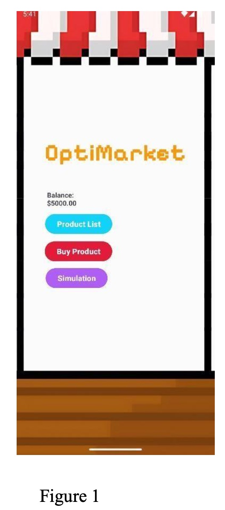
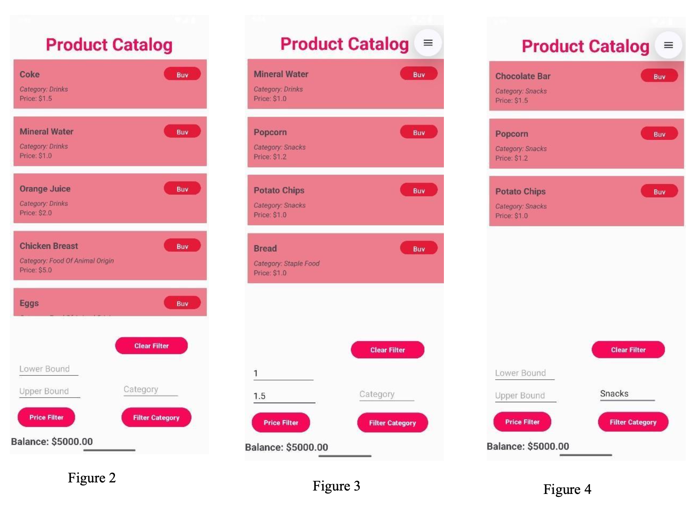
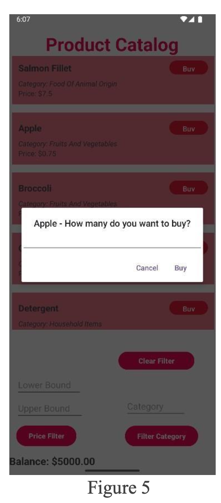
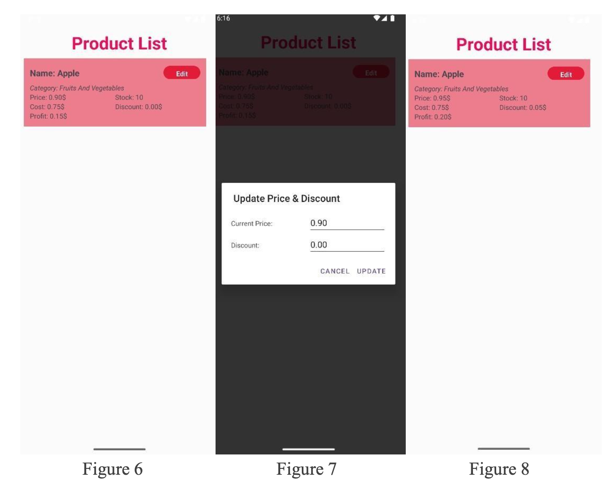
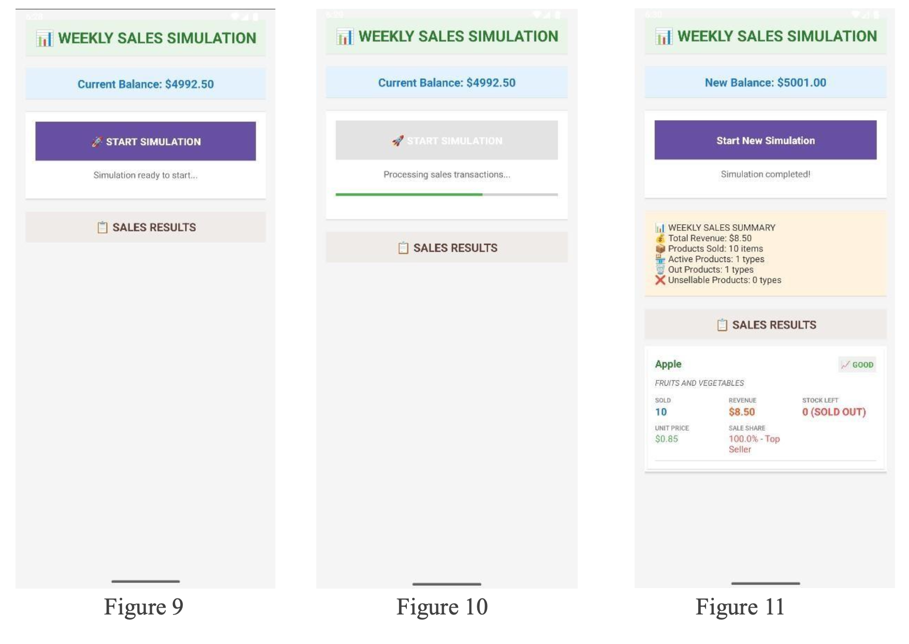

# OPTIMARKET - Mobil Alışveriş ve Stok Yönetim Simülasyonu

[cite_start]**OptiMarket**, kullanıcıların ürün satın alabildiği, bakiye ve stok yönetimi yapabildiği, ayrıca Nesne Yönelimli Programlama (OOP) prensiplerine dayalı gelişmiş bir satış simülasyonu sunan Android tabanlı bir mobil uygulamadır[cite: 11, 12, 13].

## 👥 Proje Ekibi
* [cite_start]**Enes İnançlı** - 23118080051 (Section 4) [cite: 6]
* [cite_start]**Mehmet Köksal** - 23118080060 (Section 4) [cite: 7]
* [cite_start]**Zeynep Yamaç** - 23118080080 (Section 3) [cite: 3]
* [cite_start]**Berra Yörüsün** - 23118080078 (Section 3) [cite: 4]

---

## 🚀 Proje Hakkında
[cite_start]Bu uygulama, yazılım mimarisi olarak Nesne Yönelimli Programlama (OOP) ve çeşitli tasarım desenlerini (Design Patterns) temel alarak geliştirilmiştir[cite: 13]. [cite_start]Kullanıcılar gerçekçi bir alışveriş deneyimi yaşarken, arka planda ürün yönetimi, kâr hesaplama ve dinamik stok takibi süreçleri işletilir[cite: 12, 15].

### 🛠️ Teknik Detaylar
* [cite_start]**IDE:** Android Studio Meerkat 2024.3.1 [cite: 313]
* [cite_start]**Dil:** Java (OpenJDK 21) [cite: 314]
* [cite_start]**Veritabanı:** SQLite (DatabaseHelper) [cite: 29]
* [cite_start]**Gereksinim:** Android API level 36 ve üzeri [cite: 315]

---

## 🏗️ Yazılım Mimarisi ve Tasarım Desenleri

### 💎 OOP Prensipleri
* [cite_start]**Encapsulation (Kapsülleme):** Ürün verileri `private` değişkenlerle korunmuş; erişim kontrollü `getter` ve `setter` metodlarıyla sağlanmıştır[cite: 63, 98, 99].
* [cite_start]**Inheritance (Kalıtım):** `Product` ana sınıfı, `Drinks`, `Snacks` gibi alt sınıflar tarafından miras alınarak genişletilmiştir[cite: 100, 107].
* [cite_start]**Polymorphism (Çok Biçimlilik):** `getCategory()` metodu, her ürün kategorisi için farklı sonuç dönecek şekilde geçersiz kılınmıştır[cite: 108, 114, 115].
* [cite_start]**Abstraction (Soyutlama):** `Product` sınıfı soyut (abstract) olarak tanımlanarak temel ürün şablonu oluşturulmuştur[cite: 116, 118].

### 🧩 Tasarım Desenleri (Design Patterns)
* [cite_start]**Factory Pattern:** `ProductCreator` sınıfı, kategori ismine göre uygun ürün nesnesini merkezi olarak oluşturur[cite: 145, 147, 148].
* [cite_start]**Strategy Pattern:** `ProductFilter` arayüzü ile kategori veya fiyat bazlı esnek filtreleme stratejileri uygulanmıştır[cite: 149, 150].
* [cite_start]**Singleton Pattern:** `AdminPanel` sınıfı, tüm stok ve ürün yönetimini tek bir örnek üzerinden kontrol eder[cite: 151, 152, 153].

---

## 📱 Uygulama Ekranları

### 1. Ana Ekran ve Ürün Kataloğu
[cite_start]Uygulama $5000 başlangıç bakiyesi ile açılır[cite: 35]. [cite_start]Kullanıcılar 21 farklı ürün arasından seçim yapabilir[cite: 231].

| Ana Menü | Ürün Filtreleme |
| :---: | :---: |
|  |  |
| [cite_start]*Bakiye ve Navigasyon* [cite: 156] | [cite_start]*Fiyat ve Kategori Bazlı Arama* [cite: 232] |

### 2. Satın Alma ve Stok Düzenleme
[cite_start]Ürünler miktar girilerek satın alınır[cite: 245]. [cite_start]Satın alınan ürünlerin fiyatı ve indirim oranı sonradan güncellenebilir[cite: 51, 276].

| Satın Alma Onayı | Ürün Düzenleme |
| :---: | :---: |
|  |  |
| [cite_start]*Miktar ve Onay Ekranı* [cite: 244] | [cite_start]*Fiyat ve İndirim Güncelleme* [cite: 277] |

### 3. Haftalık Satış Simülasyonu
[cite_start]Simülasyon motoru; kâr marjı, indirimler ve rastgele talep faktörlerini kullanarak haftalık satışları hesaplar[cite: 57, 58].

[cite_start]*(Şekil: Toplam Gelir, Satılan Ürünler ve Kâr Analizi Raporu [cite: 311])*

## 📚 Kaynakça
* [cite_start][Refactoring Guru - Design Patterns](https://refactoring.guru/design-patterns) [cite: 318]
* [cite_start][GeeksforGeeks - Software Design Patterns](https://www.geeksforgeeks.org/software-design-patterns/) [cite: 319]
